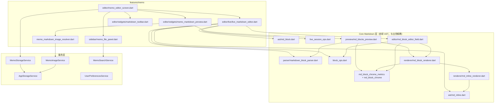

# 回念笔记 (Mind Recall)

跨平台 Markdown 备忘录应用（Flutter）。每条笔记保存为独立 `.md` 文件，支持编辑 / 实时（WYSIWYG）/ 预览三种模式，左侧文件列表、自动保存、全文搜索、本地图片。

> 本文档面向 **开发者与 Coding Agent**：说明当前架构、模块边界与关键约束，便于安全扩展功能。

---

## 基本信息

| 项 | 值 |
|---|---|
| 包名 | `mind_recall` |
| Android `applicationId` | `com.wishtech.mind_recall` |
| 版本 | 唯一源 `pubspec.yaml` 顶层 `version`（`大.小.迭代`）；APK 文件名中的 `versionName` 与设置面板展示同一值 |
| Android APK 文件名 | 分发用 `mind_recall_<versionName>_<debug\|release>.apk`；`flutter install` 仍读同目录 `app-release.apk`（内容相同，Flutter CLI 写死此名） |
| 显示名称 | 回念笔记（`lib/app_config.dart` → `kAppDisplayName`） |
| Dart SDK | `^3.10.3` |
| UI | Material 3，浅色/深色主题，中/英 i18n |

### 主要依赖

- `path_provider` / `path` — 存储路径
- `file_picker` — 插入本地图片；从侧栏导入外部 txt/md
- **无** `flutter_markdown`：预览与实时模式使用自研 AST 渲染器

---

## 功能概览

### 备忘录与文件

- 每条备忘录 → 一个 `{timestamp}.md` 文件（兼容旧 `.txt`），位于 `MindRecall/documents/`（可多层文件夹）
- 存储根目录：**各平台 Downloads 下的 `MindRecall/`**（无法访问 Downloads 时回退到应用 Documents）。笔记树在 `documents/`，与 `trash/` 分离。Android 11+ 导入公共目录备份须系统「所有文件访问」权限（卸包重装后旧备份不再视为本应用文件）
- 文件格式：`标题` + 空行 + `正文`（标题为空则整文件为正文）
- 自动保存（约 800ms debounce）；切换文件 / 切预览前 `flushSave`
- 侧栏浏览当前目录：文件夹（时间戳 id + `{id}.fileconf` 显示名）排在文件前；点进文件夹 / 返回上级；文件夹行显示目录修改时间（格式同文件）；`+` 可新建文件（当前目录，UX 同前）、新建文件夹，或导入外部 txt/md（新时间戳 id、保留 `.txt` 或 `.md`、打开新篇；先按 UTF-8 读，失败再按 GBK，保存一律 UTF-8；单独成行的本地图拷入 `{id}_assets/`，缺图不阻断）
- 新建、重命名（笔记改标题字段；文件夹只改 conf）、设置文件夹颜色（长按与 `⋮` 同一菜单；行左侧色条；写入 `{id}.fileconf` 的 `color`）、移动到已有目录（含根；长按与 `⋮` 同一菜单；搬完侧栏不跟、不切正在编辑的文档）、删除、在资源管理器中显示（文件；Android / 桌面平台）

### 编辑器三种模式 (`EditorViewMode`)

| 模式 | 组件 | 说明 |
|------|------|------|
| **编辑** `edit` | `TextField` + `MarkdownToolbar` | 直接编辑 Markdown 源码；工具栏插入 `#`、`**`、列表等 |
| **实时** `live` | `LiveMarkdownEditor` + `LiveMarkdownToolbar` | 块级 WYSIWYG；块内隐藏 `#`/`-` 等前缀；段落/列表/引用支持行内粗体/斜体/删除线/代码（标题只显示纯文本）；列表按 `ListView.builder` 虚拟化滚动 |
| **预览** `preview` | `MemoMarkdownPreview` → `MdBlocksPreview` | 只读渲染正文 Markdown（不再额外拼标题）；与实时模式共用渲染栈；切入预览时主动失焦，不立刻弹键盘。桌面滚轮用预览自持的 `ScrollController`（移动端不传，继续继承 `PrimaryScrollController`） |

三种模式共享同一数据源：`MemoEditorScreen` 的 `_titleController` / `_contentController`。

### Markdown 工具栏

- **编辑模式**（`MarkdownToolbar`）：基于 `TextEditingController` 选区插入语法（`MarkdownEditorHelper`）；含无序 / 有序 / 勾选列表、分割线、删除线 `~~`、围栏代码块（与行内代码并存）
- **实时模式**（`LiveMarkdownToolbar`）：块类型切换（H1/H2/H3、正文、无序/有序/勾选列表、引用、代码块、分割线）+ 行内 B/I/删除线/行内代码；H1/H2/H3 互切立即换字号（同属 `HeadingBlock`，须 Live `setState`，勿等自动保存）；粗体等需在**有选区**时生效；勾选列表前缀可点击切换 `- [ ]` / `- [x]`（预览只读显示）；分割线与图片同为原子块（无 TextField，点选后 × 删除）。代码块吞掉 markdown：块内除「正文」外格式按钮无效；活动代码块在正文或语言框有焦点时右上角可改围栏语言；只有「正文」拆围栏退出。代码块提交保留多行（失焦/切模式不截成第一行）；空代码块也有深色框；**最后一块是代码块**时可点文末空白插入并聚焦空段落（块内 Enter 仍不拆块）

### 搜索

- 左侧面板搜索框，空格分词 AND，可选区分大小写；搜索与「选择文档」链接覆盖**全库**，侧栏普通列表只显示当前目录。搜索结果不做移动（须回到目录列表）
- 搜索标题 + 正文；结果高亮（`HighlightedText`）；点击跳转到首个匹配处并把侧栏当前目录跟到该文件父目录，**不**自动弹出光标 / 键盘

### 图片

- 选图 → 复制到与 `.md` 同级的 `{memoId}_assets/` → 插入 ``。导出/导入备份包含该资源目录
- 预览 / 实时渲染时通过 `MarkdownImageResolver` 解析相对路径（默认 `defaultMemoMarkdownImageResolver`）。`http(s)` 图走 `Image.network`，须带 `errorBuilder`（TLS `HandshakeException` 等失败显示 alt/src，**禁止**让 Image 把异常抛给 `FlutterError` 把 debug 会话打崩）

### 其他 UX

- 宽屏（≥720px）左侧可折叠文件栏；窄屏 Drawer（左半屏 + 安全区可边缘滑动；仅系统 IME 可见时禁用侧滑；收起键盘后无光标但仍可侧滑）
- 打开已有文档默认无光标（点一下才有）；同篇开关文件栏恢复刚才的光标；换篇不继承；用户收起输入法后无光标。聚焦且 IME 仍开时，在活动块文字上垂直拖即可滚列表，单击一次落光标。新建、插入图、系统选区「记录到笔记」仍聚焦正文；搜索跳转只滚到匹配处、不自动出光标
- 设置（三大类）：**格式**（语言、主题、字体小/中/大，相对缩放 0.75 / 1.0 / 1.25；文件排序为修改时间 / 名称，默认修改时间）；**数据**（导出/导入文档目录 `MindRecall/` + `user_preferences.json`；导入须选合并或覆盖，默认合并：按文件名添加或覆盖同名，空备份不清空本地；覆盖则先清空再写入；回收站清空/恢复）；**调试**（Debug 构建总开关「启用调试」，开启后可选「显示帧率」「显示IME状态」「显示光标状态」）；记住上次打开的备忘录；顶部显示 App 版本（`pubspec.yaml` 的 `大.小.迭代`，不含 buildNumber）
- **本地会话缓存**（`session_cache.json`，应用 support 目录）：当前打开文档、当前侧栏目录、文件置顶与文件夹置顶；不可随备份迁移
- 侧栏支持置顶（后置顶靠前，左上角深色角标）；默认当前层顺序为置顶文件夹 → 置顶文件 → 文件夹（建立时间）→ 文件（最后修改时间降序）。选「名称」时非置顶文件夹与非置顶文件改为可见名称的码元升序，整段相同不再区分。搜索与移动目录树不使用该设置
- 删除有内容文档或整棵文件夹 → `MindRecall/trash/`（`manifest.json` 记原父路径；父目录不在则恢复到 `documents/` 根）；空文档直接删除
- **IME 高度缓存**（`ime_height_cache.json`，应用 support 目录）：按视口分桶记住键盘高度，重启后第一次打开即可套用；换键盘/候选栏导致高度变化时自动改写。不随备份迁移
- 编辑 / 实时 / 预览底边适配系统导航栏（`viewPadding.bottom`）
- 编辑与实时模式：长文点击底部或同一块连续打字软换行时正文上浮避开键盘（`imeBottomScrollPadding` + 主动滚入 / 换行 nudge）
- 工具栏支持插入 Markdown 链接 `[文字](url)`：可打开网页或本地文档；插入面板可「选择文档」自动填充。移动端本地链接用**文档标题**，桌面端仍可用 `./文件名.md`；解析时两种格式均支持
- AppBar：撤销/重做（编辑区）、保存状态；标题仅用户点击后进入编辑
- 新建空文档：正文框显示灰色「点击此处输入文本」（样式与标题「无标题」一致）；点正文空白区即可聚焦，不必点中第一行
- **Android 选区菜单「记录到笔记」**：其它 App 选中文本后经透明 trampoline 转入本 App 任务栈（冷/热启动均可）；不改写源 App 文本，也不把 Flutter 主界面嵌进对方任务

---

## 架构总览



### 数据流（实时模式）

1. **磁盘** ↔ `MemoStorageService` ↔ `_contentController.text`（Markdown 字符串）
2. `LiveMarkdownEditor` 经 `prepareLiveBlocksFromMarkdown` 解析为 `List<MdBlock> _blocks`（内存 AST）
3. 活动块：单块 `TextField` 显示**纯文本**（`editableTextForBlock`）；块内 markdown 存在 `ParagraphBlock.text` 等字段
4. 非活动块 / 预览：`MdBlockRenderer` 渲染（标题用纯文本，其余行内走 `MdInlineText`）
5. 变更经 `serializeMdBlocks(_blocks)` 写回 `_contentController`（`_syncToParent`）
6. Enter 拆块 / 单行插入等纯 AST 变更走 `live_session_ops.dart`；State 只负责焦点、Overlay、滚动与 `setState`

**Agent 注意**：实时模式下「显示文本」≠「存储文本」。行内格式（`**bold**`）保存在 block 的 `text` 字段；编辑区显示去掉标记后的 plain text。修改逻辑须用 `applyPlainTextChange` / `splitInlineMarkdown` 等，**不要**用纯文本直接 `copyWithPlainText` 覆盖含行内格式的块。标题不纳入 `supportsInlineFormatting`，渲染/编辑必须用 `headingVisualPlain`，**禁止**对 `HeadingBlock` 走 `MdInlineText` 解析 `~~`/`**`（否则标题与删除线共存，折叠光标会隐藏或偏移）。

**Agent 注意**：实时模式按**块**编辑，不是按 TextField 行。从编辑模式进入时，`expandMultilineParagraphsForLive` 会把含 `\n` 的段落拆成每行一块；否则 H2/列表等块级操作会作用于整段。

**行距**：同一段落内换行（Enter 或多行展开）在 AST 上标记 `ParagraphBlock.continuesWithNext`；预览与实时共用 `MdBlockStyles.bottomSpacingFor` / `slotPaddingFor`。连续段落行之间不加块间距。正文**中间** Enter 时，新块须继承被拆块原有的 `continuesWithNext`（`splitMultilineBlockAt`），否则与后续行会变成 `blockGap`，切模式重解析才恢复。正文 Enter 后立刻改成列表/标题/分割线时须 `syncParagraphFlowFlags` 清掉已过期的 flow 标记，**禁止**只信 `continuesWithNext` 而不看下一块类型（否则正文↔列表会像段内行距，切模式重解析才恢复）。标题点「正文」时，须 `paragraphFlowAfterHeadingToBody` 把新块与紧邻的上下段落收成段内行距（间距由上一块的 `continuesWithNext` 决定，只标新块收不紧它上面那条缝）；**禁止**改 `syncParagraphFlowFlags` 去给所有相邻段落打标。连续列表项用 `listItemGap`（比 `blockGap` 更紧凑）。实时槽位垂直 padding 为 0、顶边距与预览同为 `editorBodyTopPadding`，避免同样内容在实时里更疏。

**Enter 换行**（实时模式）：
- **段落块**：`_NewBlockEnterFormatter` 在光标处 `splitBlockAt` → `splitMultilineBlockAt`
- **标题 / 列表 / 引用**（单行块）：同样走 formatter → `insertBlockBelowSingleLine`；物理键盘另由 `Focus.onKeyEvent` 补 Enter → `_insertEmptyBlockBelow` 在下方插入空段落
- **代码块**：允许输入原始换行，不拆块；`commitPlainToBlock` 仅对 `isSingleLineBlock` 截第一行，**禁止**把代码块当单行提交。最后一块为代码块时，文末 `SliverFillRemaining`（`trailingAfterCodeFillKey`）点击后 `ensureEditableBlockAfterAtomic` 插入空段落并聚焦。空代码块列表槽须带 `codeBlockDecoration`（Overlay 仍 chromeless）

**块首删除**（实时模式 Backspace / IME 删除）：光标在当前块第一个字符时，把当前块全文接到**上一文本块**末尾并删除当前块，**保留上一块的块级格式**。上一块为图片/分割线等原子块时删除无效。文档首块仍是取消标题/列表等块级样式。实现为 `mergeCurrentBlockIntoPrevious`；**禁止** `copyBlockInlineMarkdown` 漏写标题/代码导致文本丢失或多出空块。

**有序列表编号**：连续 [OrderedBlock] 为一段，从 `1.` 起。工具栏把某项改成正文/无序/标题等会切断该段，后段必须 `renumberOrderedBlocksAround` 从 `1.` 重计。**禁止**只在「新块是有序」时重编号。

**Agent 注意**：实时编辑器使用**固定 Overlay 单例** `MdBlockEditorField`（`live-active-editor` key）+ `LayerLink`/`CompositedTransformFollower` 跟随活动块槽位；块列表为 `CustomScrollView` + `SliverList` 虚拟化。活动块仅占位布局，**不可**按 block.id 重建 TextField，否则 Android 会失焦。标题↔列表切换时 chromeless 层始终用 `Row + Expanded` 包裹输入框，避免结构重挂载失焦。H1/H2/H3 换级 `runtimeType` 不变，须单独 `setState` 刷新 `headingStyle(level)`；**禁止**把换级并进 `layoutChanged`（会 `_markLayoutTransition` + `forceFocus`，误走 IME 过渡）。换块后若短暂失焦，父屏会调用 `restoreFocus()`。激活非活动块时须用 `onTapDown` 全局坐标经 `plainOffsetAtGlobalTap` 落点，**禁止**写死 `offset: text.length`。空文档用 `SliverFillRemaining` 承接正文框空白点击（Overlay 仅一行高，点不到空白）；hint 叠在透明空格下方，勿再渲染「…」。最后一块为代码块时另用独立 key 的文末 fill，勿与空文档 fill 混用。聚焦 Overlay 须把垂直拖转发给外层 `CustomScrollView`（`ScrollPosition.drag`），**禁止**靠 `unfocus` / 清 `_activeBlockId` 换滚动，**禁止**外层 `onTap` 抢走单击。

**Agent 注意**：跨模式 SoT 只有 `_contentController`（Markdown 字符串）。正文 **Focus / Scroll / IME·工具栏 session** 分属 `EditInputSession` 与 `LiveInputSession`（`mode_input_session.dart`），**禁止**再合并成单一 `_contentFocusNode`。

**Agent 注意**：列表前缀 `•  `、有序 `$marker `、引用/代码缩进须统一走 `MdBlockChrome` / `MdBlockChromeMetrics`；无序/有序/勾选共用 `listPrefixSlotWidth`（有序右对齐）；勾选图标槽高与 size 须乘 `textScaler`（设置「小/大」字号），勿按未缩放 `fontSize` 当行高。**禁止**在 renderer、chromeless、预览选区镜像三处各写一份 magic string/number。

---

## 目录结构

```
lib/
├── main.dart                          # 入口，MaterialApp
├── app_config.dart                    # 应用显示名
├── app_layout_constants.dart          # 宽屏断点、标题预览长度等
├── theme/app_theme.dart               # 浅色/深色 ThemeData
├── branding/app_icon_painter.dart     # 应用图标 Canvas 绘制（可导出 PNG）
├── core/debug/
│   ├── debug_timeline.dart            # DevTools Timeline 埋点（仅 debug）
│   ├── live_editor_timeline.dart      # Live.applyBlockType / [LiveTap] 参数纯函数
│   ├── ime_timeline.dart              # IME metrics/settle/commit/scroll/visualShift 埋点
│   ├── ime_debug_hud.dart             # 屏上 IME HUD 快照 / publish
│   ├── cursor_debug_hud.dart          # 屏上光标 HUD 快照 / publish
│   ├── debug_info_overlay.dart        # 左上角调试信息列表（IME / 光标为列表项）
│   └── debug_fps_overlay.dart         # 设置「启用调试」后的 FPS 徽标
├── core/ui/
│   ├── keyboard_stable_media_query.dart  # 忽略键盘 viewInsets，避免 IME 动画整树重建
│   ├── ime_height_cache.dart          # 按视口分桶缓存 IME 高度；settle / 工具栏同拍决策
│   └── ime_metrics_observer.dart      # Live/Edit 共用的 IME metrics Observer
├── core/markdown/                     # ★ Markdown 核心层（无业务依赖）
│   ├── markdown.dart                  # barrel export
│   ├── ast/
│   │   ├── md_block.dart              # 块 AST + serializeMdBlocks
│   │   └── md_inline.dart             # 行内 AST + parse/apply/split/merge
│   ├── parser/
│   │   ├── markdown_block_parser.dart # 字符串 ↔ MdBlock 列表
│   │   └── md_syntax_patterns.dart    # 块级正则（parser 与 trigger 共用）
│   ├── block_ops.dart                 # editableTextForBlock / 粘贴 / 删块等
│   ├── live_session_ops.dart          # 实时加载/拆块/单行 Enter（纯函数）
│   ├── live_block_tap_ops.dart        # 非活动块点击 → plain caret；正文段落/文末 affinity
│   ├── live_line_markdown.dart        # 单行块 line markdown 重解析
│   ├── md_block_chrome_metrics.dart   # chrome 常量（无 Flutter 依赖）
│   ├── renderer/
│   │   ├── md_block_chrome.dart       # 前缀/缩进 Widget 与 EdgeInsets
│   │   ├── md_block_renderer.dart     # 块 WYSIWYG 只读渲染
│   │   ├── md_inline_renderer.dart    # MdInlineText（Text.rich）
│   │   ├── md_block_styles.dart       # 标题/引用/代码块样式
│   │   └── markdown_image_resolver.dart  # 图片解析 typedef（注入）
│   ├── editor/
│   │   └── md_block_editor_field.dart # 实时模式活动块 TextField + 叠加层
│   └── preview/
│       └── md_blocks_preview.dart     # 预览 ListView
├── features/memo/                     # ★ 备忘录功能模块
│   ├── memo_markdown_image_resolver.dart  # MemoImageService → resolver 桥接
│   ├── editor/
│   │   ├── memo_editor_screen.dart    # 主界面：侧栏 + 三模式 + 自动保存
│   │   ├── memo_workspace_controller.dart  # 列表 / 保存 / 搜索 / 置顶 / 备份回收站
│   │   ├── edit_ime_coordinator.dart  # 编辑模式 IME settle / nudge / 工具栏同拍
│   │   ├── live/
│   │   │   └── live_markdown_editor.dart  # 实时 UI 状态机（委托 live_session_ops）
│   │   ├── mode_input_session.dart    # 编辑/实时私有 Focus·Scroll·session
│   │   ├── plain_text/
│   │   │   └── markdown_editor_helper.dart  # 编辑模式选区包裹语法
│   │   └── widgets/
│   │       ├── markdown_toolbar.dart  # 编辑/实时两套工具栏
│   │       ├── keyboard_aware_markdown_toolbar.dart  # 窄屏贴键盘工具栏
│   │       ├── rename_memo_dialog.dart
│   │       ├── folder_name_dialog.dart
│   │       ├── folder_color_dialog.dart
│   │       ├── move_to_folder_dialog.dart
│   │       ├── import_backup_dialog.dart
│   │       ├── trash_restore_dialog.dart
│   │       ├── link_insert_dialog.dart
│   │       └── memo_markdown_preview.dart
│   └── sidebar/
│       ├── memo_file_panel.dart
│       └── memo_file_panel_logic.dart  # 搜索态 / 当前目录返回上级 / 半屏边缘拖动 / 开抽屉 IME 纯逻辑
├── shared/widgets/                    # 跨功能 UI
│   ├── highlighted_text.dart
│   ├── rgb_color_picker.dart          # RGB 滑条（文件夹设色可替换）
│   └── settings_panel.dart
├── models/
│   ├── memo.dart
│   ├── memo_folder.dart               # 文件夹与当前层条目
│   ├── memo_search_result.dart
│   └── user_preferences.dart
├── services/
│   ├── app_storage_service.dart
│   ├── memo_storage_service.dart
│   ├── memo_fs_constants.dart        # documents / fileconf / 相对路径
│   ├── memo_image_service.dart
│   ├── memo_search_service.dart
│   ├── user_preferences_service.dart
│   ├── session_cache_service.dart     # 本地会话缓存（不可迁移）
│   ├── ime_height_cache_store.dart    # IME 高度应用缓存（support 目录，不可迁移）
│   ├── data_backup_service.dart       # 文档 + 偏好 导出/导入（导入默认合并）
│   ├── memo_trash_service.dart        # 回收站 + manifest
│   ├── android_storage_permission.dart
│   ├── process_text_capture.dart      # 选区文本规范化 / 是否复用空篇
│   └── android_process_text.dart      # Android PROCESS_TEXT EventChannel
└── l10n/                              # gen-l10n，arb: app_zh / app_en

test/                              # 单元测试根目录（不参与 App 打包）
├── md_inline_test.dart
├── markdown_block_ast_test.dart
├── md_block_chrome_test.dart
├── live_session_ops_test.dart
├── live_block_ops_test.dart
├── live_block_tap_ops_test.dart
├── live_caret_handle_test.dart
├── live_overlay_scroll_test.dart
├── md_blocks_preview_test.dart
├── markdown_editor_helper_test.dart
├── memo_storage_service_test.dart
├── folder_color_hex_test.dart
├── memo_workspace_controller_test.dart
├── memo_trash_service_test.dart
├── session_cache_service_test.dart
├── process_text_capture_test.dart
├── android_process_text_manifest_test.dart
├── android_apk_output_name_test.dart
├── project_pack_skill_test.dart
├── app_version_test.dart
├── memo_search_service_test.dart
├── memo_image_service_test.dart
├── highlighted_text_test.dart
├── user_preferences_test.dart
└── widget_test.dart

scripts/
├── run_unit_tests.ps1             # Windows：全量单元测试门禁
└── run_unit_tests.sh              # macOS/Linux：同上

.cursor/
├── rules/                         # Agent 持久规则
└── skills/
    ├── mode-explore/SKILL.md      # 只读探索；建议 patch 或 propose
    ├── mode-patch/SKILL.md        # 根因已清且无架构隐患时按短方案改工程
    ├── mode-propose/SKILL.md      # 只写 proposes/<name>/{schemes,tasks}.md
    ├── mode-implement/SKILL.md    # 未决为空才落实；按步骤勾选
    ├── mode-archive/SKILL.md      # 将完成的方案目录移到 agents/archives/<YYYYMMDD>_<name>
    └── project-pack/SKILL.md      # 打 debug/release APK，标准包体名

agents/
├── proposes/                      # 待落实方案：<name>/schemes.md + tasks.md
├── archives/                      # 已完成方案归档：<YYYYMMDD>_<name>/（按需生成）
└── fixed_list.md                  # 已修复 Bug 台账
```

---

## Markdown AST 设计

### 块级 (`MdBlock`)

| 类型 | 说明 | `toMarkdown()` 示例 |
|------|------|-------------------|
| `HeadingBlock` | 1–6 级标题（不渲染行内格式） | `# title` |
| `ParagraphBlock` | 段落（可含行内 markdown） | 原文 |
| `BulletBlock` / `OrderedBlock` | 列表；`BulletBlock.checked != null` 为 GFM 勾选 | `- item` / `- [ ] item` / `- [x] item` / `1. item` |
| `QuoteBlock` | 引用 | `> text` |
| `CodeBlock` | 围栏代码块 | ` ``` ` |
| `ImageBlock` | 图片行 | `` |
| `ThematicBreakBlock` | 分割线 | `---`（读入 `***` / `___` 后亦写成 `---`） |

`MdBlock.supportsPlainEditing`：实时是否用 TextField 编辑块体。图片与分割线为 `false`（原子块：点选 + × 删除，不挂 Overlay）；标题/段落/列表/引用/代码为 `true`。

解析：`parseMarkdownBlocks()` in `core/markdown/parser/markdown_block_parser.dart`  
序列化：`serializeMdBlocks()` in `core/markdown/ast/md_block.dart`  
块编辑辅助：`core/markdown/block_ops.dart`（`editableTextForBlock`、`copyBlockInlineMarkdown`、`renumberOrderedBlocksAround` 等）  
会话纯函数：`core/markdown/live_session_ops.dart`（`prepareLiveBlocksFromMarkdown`、`splitMultilineBlockAt`、`insertBlockBelowSingleLine`、`mergeCurrentBlockIntoPrevious`）  
块外壳几何：`md_block_chrome_metrics.dart` + `renderer/md_block_chrome.dart`（renderer / chromeless / 预览选区共用；勾选图标行高须乘 `textScaler`）

### 行内 (`MdInline`)

| 类型 | Markdown |
|------|----------|
| `TextInline` | 纯文本 |
| `BoldInline` | `**...**` |
| `ItalicInline` | `*...*` |
| `StrikeInline` | `~~...~~` |
| 粗斜体（嵌套） | `***...***` / `___...___`（解析为 Bold+Italic，序列化为 `***`） |
| `CodeInline` | `` `...` `` |

关键 API（`core/markdown/ast/md_inline.dart`）：

- `parseInlineMarkdown` / `serializeInlineMarkdown`
- `applyInlineStyle` — 实时工具栏 B/I/删除线/行内代码（工具栏序列化顺序：粗 > 斜 > 删除线）
- `splitInlineMarkdown` — Enter 换行时按 plain 偏移拆分 markdown
- `applyPlainTextChange` — 键入时保留行内格式
- `mergeInlineMarkdown` — Backspace 合并块

渲染：`MdInlineText`（`Text.rich` + `FontWeight.w700` 等）

### 实时模式编辑块 (`MdBlockEditorField`)

- 位于 `core/markdown/editor/md_block_editor_field.dart`
- 活动块：`TextField` + 可选**透明叠加层**（底层 `MdInlineText` 显示粗体，顶层透明字输入）
- 须禁用 `InputDecoration` 填充色，否则叠加层被遮挡
- 叠加条件：`hasRenderedInlineFormatting(block)` 且 controller 与 `editableTextForBlock` 同步

### 图片解析注入

Core 层不依赖 `MemoImageService`。预览/实时通过 `MarkdownImageResolver` 注入本地图片解析；备忘录模块提供 `defaultMemoMarkdownImageResolver`。

### 共享渲染

预览与实时（非活动块）均走 `MdBlockRenderer` → `MdInlineText`，**不要**为预览单独引入另一套 Markdown 库。列表前缀与引用/代码缩进与 chromeless Overlay、预览选区镜像共用 `MdBlockChrome`。

---

## `LiveMarkdownEditor` API（供工具栏 / 屏幕调用）

通过 `GlobalKey<LiveMarkdownEditorState>` 调用：

| 方法 | 作用 |
|------|------|
| `captureForInlineAction()` | 工具栏 `PointerDown` 时缓存选区（防 Android 失焦丢选区） |
| `applyBold()` / `applyItalic()` / `applyStrikethrough()` / `applyInlineCode()` | 行内样式 |
| `applyHeading(level)` / `applyBulletList()` / `applyCodeBlock()` / … | 块类型；代码块内除 `applyParagraph()` 外格式 no-op |
| `splitBlockAt(cursor)` | Enter 换行 |
| `flushToParent()` | 提交活动块并同步到 parent controller（切模式 / dispose 前） |

内部标志：

- `_programmaticFieldUpdate` — 程序更新 controller 时不触发 plain 覆盖 markdown
- `_syncingToParent` — 防止 parent listener 循环 reload

---

## 存储与文件布局

```
Download/MindRecall/          # 或平台等价 Downloads 路径
├── 1783091482537.md
├── 1783091482537_assets/     # 该笔记的图片
│   └── photo.png
└── ...
```

- 备忘录 `id` = 文件名（毫秒时间戳，无扩展名）
- 重命名只改文件内「标题」行，**不改**磁盘文件名
- 删除备忘录时同时 `deleteAssets(memoId)`

---

## 测试

**约定**：所有单元测试放在 `test/`（不参与打包）。每完成一项功能 / 优化 / bug 修复，须补测并用脚本**全量跑通**后才算完成。

```bash
# 推荐门禁（Agent / 开发者收尾必跑）
.\scripts\run_unit_tests.ps1      # Windows
./scripts/run_unit_tests.sh       # macOS / Linux

# 等价 / 调试
flutter test test/                # 全量
flutter test test/md_inline_test.dart
dart analyze lib
```

覆盖：行内 parse/apply/split、块 parse、预览粗体渲染、存储解析、搜索、图片路径、编辑器 helper。Cursor 规则见 `.cursor/rules/unit-testing.mdc`。

---

## 开发命令

```bash
flutter pub get
flutter gen-l10n    # 一般由 build 触发；修改 arb 后需要
flutter run
flutter run -d windows
flutter build apk --release   # 标准包体 mind_recall_<version>_release.apk
flutter build apk --debug     # 标准包体 mind_recall_<version>_debug.apk
```

Windows 首次构建若遇 symlink 错误，需开启「开发人员模式」或以管理员运行 `flutter pub get`。

---

## 给 Agent 的扩展指南

### 工作流模式

- **mode-explore**（`.cursor/skills/mode-explore/SKILL.md`）：显式启用后只读探索，只允许读文件与跟用户互动；**禁止**对仓库做任何增删改。只**建议**下一跳，不能代执行。默认建议 **mode-propose**；仅当本次已写出根因且按该根因落地无架构隐患时才建议 **mode-patch**。→ propose 交事实与分叉；→ patch 在对话里给短方案（现象 / 根因 / 文件与函数 / 回归点），不写 `schemes.md` / `tasks.md`。不改版本号。
- **mode-patch**（`.cursor/skills/mode-patch/SKILL.md`）：按 explore 短方案改工程（局部修复或优化）。不写 `agents/proposes/`、不归档。根因必须来自上一跳 explore；缺失、仍是假说、或动手后发现分叉/架构面则停手，打回 **mode-explore** 或 **mode-propose**。仍须补测、跑 `scripts/run_unit_tests`；Bug 则双写 `agents/fixed_list.md`。成功交付后将 `pubspec.yaml` 迭代 +1。
- **mode-propose**（`.cursor/skills/mode-propose/SKILL.md`）：只写 `agents/proposes/<name>/schemes.md`（目标 / 方案 / 已决事项 / 关注点 / 未决事项）与 `tasks.md`（按步骤分组的勾选列表）。设计阶段把行为分叉交给用户拍板；**未决非空不得宣称可落实**。同一目标不够落地时修订该目录。若从 **mode-patch** 打回，把分叉或架构面写入合同。若用户要求改工程目录且合同已闭合，提示使用 **mode-implement**。不改版本号。
- **mode-implement**（`.cursor/skills/mode-implement/SKILL.md`）：扫描 `agents/proposes/`，默认一次落实一个已闭合方案；先读已决与关注点，再按 `tasks.md` 步骤勾选。接线可做，合同外选择与未决事项视为停手，打回 **mode-propose**，禁止推翻已决或用领域常识补行为。该方案全部勾完且门禁通过后将小版本 +1、迭代置 0。
- **mode-archive**（`.cursor/skills/mode-archive/SKILL.md`）：询问用户 propose 名称，将对应**目录**（或遗留单文件）从 `agents/proposes/` 移到 `agents/archives/<YYYYMMDD>_<name>/`（日期为归档当天，如 `add_text_block` → `20260912_add_text_block`）。不改版本号。
- **project-pack**（`.cursor/skills/project-pack/SKILL.md`）：用户说「打一个release包 / 打个debug包 / 打包」时执行 `flutter build apk`；分发名为 `mind_recall_<versionName>_<debug|release>.apk`（版本取 `pubspec.yaml`，由 Gradle 命名）。不改版本号。

大版本不由 AI 改。

### 性能 Timeline 埋点

- 工具：`lib/core/debug/debug_timeline.dart`（仅 `kDebugMode` 生效，profile/release 零开销）
- 屏上 FPS：设置 →「启用调试」→「显示帧率」→ `DebugFpsOverlay`；绿=流畅，红=近窗有慢帧或平均 < 50 FPS
- 屏上调试信息列表：设置 →「启用调试」→ 子开关 → `DebugInfoOverlay`（左上角同一列表）；IME / 光标数据各为列表段（分隔线隔开）。IME：`p/c/t`、`burst`/`rst`/`settle`、`commit=`；光标：Live 块序号/类型/id 与选区前后文，Edit 文档选区/行列；`ctx «前|后»` 中 `|` 为光标；Live 另有 `ov hit/view imeF/edF/langF sameTap`（Overlay 是否吃点击 / 是否在视口 / 会话焦点 / 同块丢落点）
- 事件名：`App.prefsLoad`、`App.imeHeightCacheLoad`、`Editor.*`（启动/打开文档）、`Live.*`（解析/换块/滚入/聚焦）、`Ime.*`（键盘 metrics/settle/commit/scroll/**visualShift**）。块类型切换：`Live.applyBlockType`（arguments：`from`/`to`/`layoutChanged`/`didSetState`）；H1/H2/H3 换级须 `didSetState`（`layoutChanged` 仍为 false）；同类型且无需刷新 UI 时才 `Live.applyBlockType.skipSetState`；父屏已聚焦且已 defer 跳过整页重建时 `Editor.toolbarStabilize.skip`。列表点击定位：`Live.overlay.pointer`、`Live.slot.inkTap`、`Live.activateBlock`、`Live.restoreFocus`；logcat 搜 `[LiveTap]`（仅 pointer/tap/activate/restoreFocus，不每帧打印）
- 用法：`flutter run`（debug）→ DevTools Performance，按事件名对齐卡顿帧
- IME 停顿排查：优先看屏上 HUD；或搜 `Ime.Live.` / `Ime.Edit.` / `Ime.Toolbar.`；窄屏工具栏与正文 **nudge 同拍**显栏（有缓存 `applyCache` 当拍；无缓存 `settleDebounced`），同一次打开不爬升，仅 `raiseCache` / `correctCacheDown` 可改高度
- IME 两次上移：无缓存时 spacer 仍 48ms settle，**nudge+工具栏 120ms 防抖**后再写入应用缓存；有缓存时首次 settle 直接套用（`applyCache`）只一拍。高度持久化在 `ime_height_cache.json`（勿写入 `user_preferences.json`）。搜 `reason`=`settleDebounced` / `applyCache` / `raiseCache` / `correctCacheDown`
- 更深可视化：见下文「调试性能可视化」；勿在 release 打开叠加层逻辑（已由 `kDebugMode` 门控）

### 调试性能可视化（能力边界）

| 手段 | 能否做 | 说明 |
|------|--------|------|
| 屏上 FPS / 慢帧标红 | ✅ 已做 | `FrameTiming.totalSpan` |
| 屏上调试信息列表（IME / 光标） | ✅ 已做 | `debug_info_overlay.dart` + 各 `*_debug_hud.dart` |
| build / raster 分时 | ✅ 可扩展 | `FrameTiming.buildDuration` / `rasterDuration` 小字显示 |
| 现有 Timeline 条带 | ✅ 已有 | DevTools 对齐 `Live.*` / `Editor.*` / `Ime.*` |
| `PerformanceOverlay` | ✅ 可选 | Flutter 内置 GPU/UI 线程图，偏吵 |
| rebuild 高亮 | ✅ 可选 | `debugRepaintRainbowEnabled` / `debugProfileBuildsEnabled` |
| 业务段耗时面板 / IME 环缓冲 | ⚠️ 可选 | 汇总最近 N 次；勿每帧写盘 |
| 真机 CPU/内存曲线 | ❌ 应用内不宜重做 | 用 DevTools / Android Studio Profiler |

结论：调试模式分层——屏上轻量指标（FPS + IME HUD）；重分析继续走 DevTools + Timeline 埋点。

### 安全修改区域

- **行内 Markdown 新语法**：`core/markdown/ast/md_inline.dart` + `renderer/md_inline_renderer.dart` + `applyInlineStyle`
- **新块类型**：`ast/md_block.dart` + `parser/markdown_block_parser.dart` + `renderer/md_block_renderer.dart` + `editor/md_block_editor_field.dart` + `features/memo/editor/live/live_markdown_editor.dart`
- **编辑模式新按钮**：`features/memo/editor/widgets/markdown_toolbar.dart` + `plain_text/markdown_editor_helper.dart`
- **实时模式新按钮**：`markdown_toolbar.dart`（LiveMarkdownToolbar）+ `LiveMarkdownEditorState` 方法
- **块级正则**：优先改 `parser/md_syntax_patterns.dart`，避免 parser 与 trigger 不一致

### 模块边界

| 层 | 可依赖 | 不可依赖 |
|----|--------|----------|
| `core/markdown` | Flutter widgets | services、features、l10n |
| `features/memo` | core、services、models、shared | — |
| `services` | models | UI widgets |

### 易踩坑（已修复过的类 bug）

**权威清单**：[`agents/fixed_list.md`](agents/fixed_list.md)。修 Bug 前**先读目录**、再按需详读相关条目；修完后**目录 + 正文**双写（见 `.cursor/rules/fixed-bugs.mdc`）。勿只改 README 摘要而不更新清单。

摘要（完整条目与修复要点见该文件）：

1. 实时模式用 plain text 覆盖含 `**` 的 block → 预览/实时丢粗体  
2. `splitBlockAt` 必须 `splitInlineMarkdown`，不能直接 substring plain text  
3. 活动块 `_onActiveFieldChanged` 须用 `applyPlainTextChange`  
4. 行内工具栏在 Android 上须 `captureForInlineAction` + `canRequestFocus: false`  
5. 透明叠加编辑须 `filled: false` / 透明 `fillColor`，否则行「消失」  
6. 切离实时模式前调用 `flushToParent()`  
7. 实时模式 Enter：段落用 formatter 拆分；标题/列表/引用另可在 `Focus.onKeyEvent` 处理（勿对段落重复处理）  
8. 多行段落进实时模式须 `expandMultilineParagraphsForLive`；块级样式（H2 等）只作用于当前块  
9. 活动编辑器必须是 Stack 内**唯一持久** TextField（Overlay），不可随 block.id 销毁重建  
10. 最后一行是 H1/H2/H3 时须能 Enter 新建段落（单行块 → `_insertEmptyBlockBelow`）  
11. `BoldInline` 渲染须设 `fontWeight`；勿用会改变字形宽度的 `letterSpacing` 假粗体  
12. 插入链接对话框前须 `_suspendEditorFocus()`，否则实时模式会把 IME 抢回编辑框  
13. 长文档点底部：实时用 `ensureVisible`+nudge；同一块连续打字软换行也须 `shouldNudgeImeAfterContentWrap` 再 nudge（勿只在点击/聚焦时上浮）。编辑模式同样须 `bringIntoView`+`scrollDeltaToClearIme`（勿只靠 scrollPadding）  
14. 行内解析：`***` 须 `_isWrapped` 校验，否则可能 RangeError  
15. 实时 Overlay：活动块滚出可视区时须隐藏 Follower（并 `Clip.hardEdge`）  
16. 实时模式全选只能覆盖当前块；全文选择请用编辑/预览模式  
17. 活动块光标须与 `MdInlineText` 度量对齐（透明 TextField 勿单独依赖系统光标/折叠水滴位置）。系统折叠手柄关掉后须按渲染层光标**自绘**水滴，勿直接移除。水滴应对准光标中线（`kTextCaretWidth/2`），打字后隐藏、点选再显示（对齐编辑模式）。文末测光标用 `TextAffinity.upstream`，找段落须跳过列表 chrome 前缀  
18. chromeless 换块类型须固定 `Row+Expanded` 包 TextField，否则 IME 会收起  
19. 实时模式图片：点击选中后右上角 × 删除；活动图片不挂 TextField Overlay  
20. 空块勿渲染「…」占位；须保留透明空格/`RenderParagraph` 供光标测量。空**文档**可另叠灰色 hint（`emptyBodyHint`），勿用 hint 替换占位字符  
21. 多行粘贴不可被 Enter formatter 吞掉；须 `pasteMarkdownIntoBlocks`（`•`→`-`）  
22. 预览选区几何对齐渲染层；复制再转为 Markdown 数据  
23. 块 chrome（`•  `/缩进）须改 `MdBlockChrome`，勿在三处各写 magic 值；列表前缀槽宽走 `listPrefixSlotWidth`  
24. 实时加载/Enter 拆块逻辑优先改 `live_session_ops.dart` 并补纯函数单测  
25. Android IME（卡顿/跳动/留白）：终态约束见 `agents/fixed_list.md` → **2026-08-02 — Android IME：开关卡顿、跳动与留白（整合）**。二次上推：无缓存 nudge+工具栏 120ms 防抖后写入应用缓存；有缓存首次 settle 套用并同拍显栏（`ime_height_cache.dart` / `ime_height_cache_store.dart`）。禁止 MediaQuery.of / 步进正文 UI / 工具栏分帧爬升或跟手显栏 / 大块 IME 进 contentPadding。
27. 编辑/实时勿共用 FocusNode·ScrollController·hadFocus；用 `EditInputSession` / `LiveInputSession`
28. 实时模式开抽屉：菜单按钮须等 IME inset 收起（轮询，上限宜短）且抽屉子树 `removeViewInsets(removeBottom)`；边缘侧滑区为半屏+安全区，门禁只认系统 IME inset（勿用 hasFocus/hadFocus 否决；**收起键盘会丢掉光标**，仍可侧滑）；inset 阈值翻转才 setState；文件 ListView 勿 `primary: true`；宽屏侧栏揭示用动画 `onEnd` 勿裸 Timer
29. 非活动块激活：`onTapDown` → `plainOffsetAtGlobalTap`；勿写死块末 caret
30. 实时光标：按列表层 `RenderParagraph` 实测；若段落 plain 尚未跟上 controller，须再等一帧测量，勿把光标钉在旧字后（父级 `_syncToParent` 有 120ms debounce，不能当光标刷新）
31. Android「记录到笔记」：`PROCESS_TEXT` 必须用 `ProcessTextActivity` trampoline（`NEW_TASK` 打开 `MainActivity` 后立刻 `finish`/`RESULT_CANCELED`）。**禁止** `activity-alias` 到 Flutter `MainActivity`，否则源 App 黑屏卡住
32. Android 11+ 导入 `Download` 备份：须 `MANAGE_EXTERNAL_STORAGE`（导入/导出前打开系统授权页）。卸包重装后 **禁止** 只靠 `File.copy` 读公共目录文件，会 `Permission denied`。图片在 `{id}_assets/`，导入须 Java `listFiles` + 按 Markdown 引用补拷，并声明 `READ_MEDIA_IMAGES`；**禁止**以为拷了 `.md` 图片就在。导入默认 **合并**（`DataBackupImportMode.merge`）：按文件名拷贝，空备份不得 `_clearDirectoryContents`。覆盖须用户显式选择 `overwrite`
33. 切文档须丢掉壳层 Focus（`_titleFocusNode` / Edit / Live session），`_resumeEditorFocus` 须比对 suspend 时 memoId；搜索跳转禁止 `requestFocus`。Live 失焦 Overlay 须 `IgnorePointer`，勿只藏光标；用户收 IME 用 inset **下落** unfocus，禁止「hasFocus 且 inset≈0」。同一轮收键盘只丢一次焦点，unfocus 放帧末。聚焦 Overlay 须把垂直拖转发给外层 `CustomScrollView`，禁止靠 `unfocus`/清 `_activeBlockId` 换滚动，禁止外层 `onTap` 抢走单击
34. 活动块列表槽须**始终**挂 `InkWell`（聚焦时由 Overlay 在上层吃点击）。**禁止**随焦点拆掉正在处理 `onTap` 的命中目标，否则 Android/MIUI 会 ANR
35. 标题禁止 `MdInlineText` 解析 `~~`/`**`；须 `headingVisualPlain`，否则删除线与标题共存、实时折叠光标隐藏或偏移
36. 实时 H1/H2/H3 换级 `runtimeType` 不变，须 `setState` 刷新 `headingStyle`；禁止并进 `layoutChanged`（会 forceFocus / IME 布局过渡）。见 `agents/fixed_list.md` → **2026-09-19 — 实时 H1/H2/H3 互切字号滞后**
37. 桌面预览滚轮：`Scrollbar` 与 `ListView` 须共用显式 `ScrollController`，并关掉桌面自动第二条滚动条。移动端保持 `controller: null` 以继承 `PrimaryScrollController`。禁止为修桌面给安卓接显式 controller，也禁止 `primary: true` 去占 Scaffold 主控制器。见 `agents/fixed_list.md` → **2026-10-01 — 桌面预览滚轮 Scrollbar 无 ScrollPosition**
38. `parseMarkdownBlocks` 切开前须把 `\r\n` / `\r` 换成 `\n`。只 `split('\n')` 时行尾 `\r` 会让标题和有序列表的 `$` 匹配失败，字面 `###` / `1. ` 留在正文里。禁止只改标题正则。见 `agents/fixed_list.md` → **2026-10-01 — CRLF 标题与有序列表被当成正文**

### 撤回 / 重做

AppBar 的撤回/重做基于 `DocumentHistory`（`features/memo/editor/document_history.dart`）：对**标题 + 正文 Markdown** 做快照，三种模式通用。实时模式撤回后会调用 `LiveMarkdownEditorState.reloadFromMarkdown` 重建块 AST。

### 尚未实现 / 可选后续

- 编辑模式 WYSIWYG（当前仅源码）
- 活动块行内编辑与光标在粗体区精确对齐（叠加层方案有 proportional font 偏差）
- 粘贴 Markdown 智能分块
- 表格、代码高亮等 GFM 扩展（勾选列表 `- [ ]` / `- [x]` 已支持；有序任务与嵌套列表未做）

### 修改后必须

1. 为本次改动新增/更新 `test/<主题>_test.dart`
2. 跑通门禁脚本：`.\scripts\run_unit_tests.ps1`（或 `./scripts/run_unit_tests.sh`）；失败则继续迭代，禁止未绿即交付
3. **若为 Bug 修复**：先读 [`agents/fixed_list.md`](agents/fixed_list.md) **目录**，再按需详读相关条目；修完后目录+正文双写（见 `.cursor/rules/fixed-bugs.mdc`）
4. 手动验证（若涉及编辑器）：**编辑** 写 `**x**` → **预览** 见粗体 → **实时** 加粗 → Enter 换行 → 上一行仍粗体 → 点击含粗体行不消失
5. 保持 `_contentController` 为 Markdown 源码唯一持久化格式（磁盘一致）

### 应用图标

图标由 Flutter Canvas 绘制（`lib/branding/app_icon_painter.dart`），重新生成：

```bash
flutter test tool/generate_app_icon_test.dart
dart run flutter_launcher_icons
```

输出：`assets/branding/app_icon.png`（完整）与 `app_icon_foreground.png`（Android adaptive 前景）。

---

## 许可证

私有项目（`publish_to: 'none'`）。
